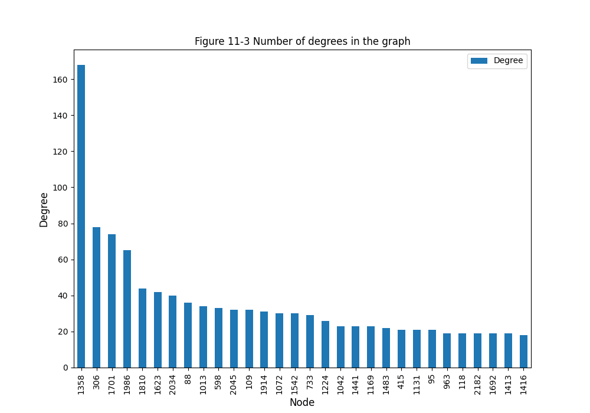
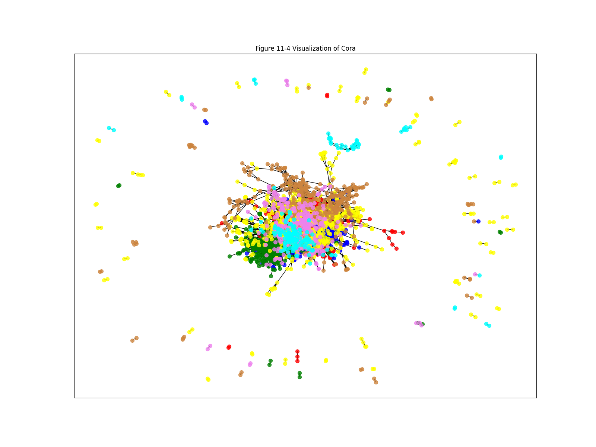
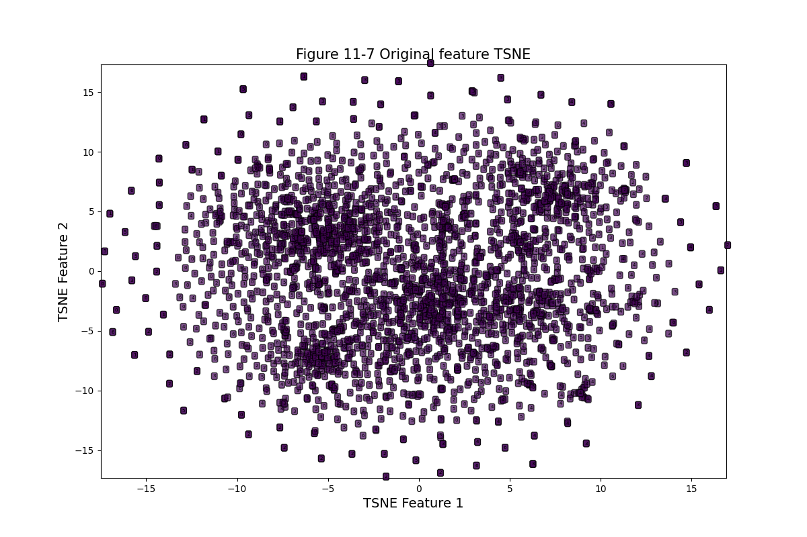

# 11.2 Semi-Supervised Graph Convolutional Network

# 1. Code
```python
import numpy as np
import pandas as pd
import matplotlib.pyplot as plt

import torch
import torch.nn.functional as F
from torch import device

from torch_geometric.nn import GCNConv
from torch_geometric.datasets import Planetoid
from torch_geometric.utils import to_networkx

import networkx as nx

from sklearn.metrics import accuracy_score
from sklearn.manifold import TSNE
from sklearn.svm import SVC
from sklearn.semi_supervised import _label_propagation


def visualNodes(Node_degree):
    Node_degree.iloc[0:30, :].plot(x='Node', y='Degree', kind='bar', figsize=(10, 7))
    plt.xlabel('Node', size=12)
    plt.ylabel('Degree', size=12)
    plt.title('Figure 11-3 Number of degrees in the graph')
    plt.show()
    plt.savefig('./Images/11_3_Number-of-degrees-in-the-graph')

def visualConnectionsDistribution(CoraNet):
    pos = nx.spring_layout(CoraNet)
    nodecolor = ['red', 'blue', 'green', 'yellow', 'peru', 'violet', 'cyan']
    nodelabel = np.array(list(CoraNet.nodes))
    # visualize the network using networkx
    plt.figure(figsize=(16, 12))
    for ii in np.arange(len(np.unique(Node_class))):
        nodelist = nodelabel[Node_class == ii]
        nx.draw_networkx_nodes(CoraNet, pos, nodelist=list(nodelist),
                               node_size=50,
                               node_color=nodecolor[ii],
                               alpha=0.8)
    # adding edges for the network
    nx.draw_networkx_edges(CoraNet, pos, width=1, edge_color='black')
    plt.title('Figure 11-4 Visualization of Cora')
    plt.show()
    plt.savefig('./Images/11_4_Visualization-of-Cora.png')


def visualNodesDistribution(CoraNet, dataset):
    pos = nx.spring_layout(CoraNet)
    nodecolor = ['red', 'blue', 'green', 'yellow', 'peru', 'violet', 'cyan']
    nodelabel = np.arange(0, 140)
    Node_class = dataset.data.y.data.numpy()[0:140]
    # visualize the network using networkx
    plt.figure(figsize=(8, 6))
    for ii in np.arange(len(np.unique(Node_class))):
        nodelist = nodelabel[Node_class == ii]
        nx.draw_networkx_nodes(CoraNet, pos, nodelist=list(nodelist),
                               node_size=50,
                               node_color=nodecolor[ii],
                               alpha=0.8)
    plt.title('Figure 11-5 Distribution of nodes in the training set of Cora')
    plt.show()
    plt.savefig('./Images/11_5_Distribution-of-nodes-in-the-training-set-of-Cora.png')

def visualLossFunction(train_loss_all, val_loss_all):
    plt.figure(figsize=(10, 6))
    plt.plot(train_loss_all,'ro-',label='Train loss')
    plt.plot(val_loss_all,'bs-',label='Val loss')
    plt.legend()
    plt.grid()
    plt.xlabel('Epoch',size=14)
    plt.ylabel('Loss', size=14)
    plt.title('Figure 11-6 Training of graph convolutional network')
    plt.show()
    plt.savefig('./Images/11_6_Training-of-graph-convolutional-network')

def visualDimensionReducedData(dataset):
    plt.figure(figsize=(12,8))
    axl = plt.subplot(1,1,1)
    X = x_tsne[:,0]
    Y = x_tsne[:,1]
    axl.set_xlim([min(X),max(X)])
    axl.set_ylim([min(Y),max(Y)])
    for ii in range(x_tsne.shape[0]):
        text = dataset.data.y.data.numpy()[ii]
        axl.text(X[ii],Y[ii],str(text),fontsize=5,
                 bbox=dict(boxstyle='round', facecolor=plt.cm.get_cmap().colors[text],alpha=0.7))
    axl.set_xlabel('TSNE Feature 1',size=14)
    axl.set_ylabel('TSNE Feature 2',size=14)
    axl.set_title('Figure 11-7 Original feature TSNE',size=15)
    plt.show()
    plt.savefig('./Images/11_7_Original-feature-TSNE.png')


def get_activation(name):
    def hook(model, input, output):
        activation[name] = output.detach()
    return hook

def visualHiddenLayer(conv1_tsne):
    plt.figure(figsize=(12,8))
    axl = plt.subplot(1,1,1)
    X = conv1_tsne[:,0]
    Y = conv1_tsne[:,1]
    axl.set_xlim([min(X),max(X)])
    axl.set_ylim([min(X),max(Y)])
    print(X)
    for ii in range(conv1_tsne.shape[0]):
        text = dataset.data.y.data.numpy()[ii]
        axl.text(X[ii],Y[ii],str(text),fontsize=5,
                 bbox=dict(boxstyle='round',facecolor=plt.cm.get_cmap().colors[text]),alpha=0.7)
    axl.set_xlabel('TSNE Feature 1',size=14)
    axl.set_ylabel('TSNE Feature 2',size=14)
    axl.set_title('Figure 11-8 GCN feature TSNE')
    plt.show()
    plt.savefig('./Images/11_8_GCN-feature-TSNE.png')


# data preparation

dataset = Planetoid(root='data/Image/Cora',
                    name='Cora')

# print('Number of classes in the network: ', dataset.num_classes)
# print('Number of features of edges in the network: ', dataset.num_edge_features)
# print('Number of edges in the network data: ', dataset.data.edge_index.shape[1] / 2)
# print('Number of features of nodes in the network: ', dataset.num_node_features)
# print('Number of nodes in the network: ', dataset.data.x.shape[0])

# analysis on data in the dataset
dataset_data = dataset.data
# print(dataset_data)

# explore ways of connection of nodes in networks
edge_index = dataset.data.edge_index
# print(edge_index)

# explore split of training set, validation set and test set
train_mask = dataset.data.train_mask
val_mask = dataset.data.val_mask
test_mask = dataset.data.test_mask

# print('Number of nodes in training set: ', sum(train_mask))
# print('Number of nodes in validation set: ', sum(val_mask))
# print('Number of nodes in test set: ', sum(test_mask))


# check if the network is undirected grid or not
isUndirected = dataset.data.is_undirected()
# print(isUndirected)

# data exploration
CoraNet = to_networkx(dataset.data)
CoraNet = CoraNet.to_undirected()
# print('Check if the network is undirected grid: ',isUndirected)

number_of_edges = CoraNet.number_of_edges()
number_of_nodes = CoraNet.number_of_nodes()
# print('Number of edges in the network: ', number_of_edges)
# print('Number of node in the network: ', number_of_nodes)


Node_class = dataset.data.y.data.numpy()
# print('Node classes: ', Node_class)

# explore degrees in every node and sort in decreasing way
Node_degree = pd.DataFrame(data=CoraNet.degree, columns= ['Node','Degree'])
Node_degree = Node_degree.sort_values(by=['Degree'],ascending=False)
Node_degree = Node_degree.reset_index(drop=True)

# using histogram to visualize top 30 nodes which have most degrees
# visualNodes(Node_degree)


# visualize distribution of connections between nodes
# visualConnectionsDistribution(CoraNet)


# visualize distribution of nodes in the training set
# visualNodesDistribution(CoraNet,dataset)


class GCNnet(torch.nn.Module):
    def __init__(self, input_feature, num_classes):
        super(GCNnet, self).__init__()
        self.input_feature = input_feature
        self.num_classes = num_classes
        self.conv1 = GCNConv(input_feature, 32)
        self.conv2 = GCNConv(32, num_classes)

    def forward(self, data):
        x, edge_index = data.x, data.edge_index
        x = self.conv1(x, edge_index)
        x = F.relu(x)
        x = self.conv2(x, edge_index)
        return F.softmax(x, dim=1)


# network initialization
input_feature = dataset.num_node_features
num_classes = dataset.num_classes
mygcn = GCNnet(input_feature, num_classes)
# print(mygcn)

device: device = torch.device('cuda' if torch.cuda.is_available() else 'cpu')
# print(device)
model = mygcn.to(device)
data = dataset[0].to(device)
optimizer = torch.optim.Adam(model.parameters(),lr=0.01, weight_decay=5e-4)
train_loss_all = []
val_loss_all = []
model.train()

for epoch in range(200):
    optimizer.zero_grad()
    out = model(data)
    # only use classes labels of training set when computing loss
    loss = F.cross_entropy(out[data.train_mask],data.y[data.train_mask])
    loss.backward()
    optimizer.step()
    train_loss_all.append(loss.cpu().data.numpy())
    # compute loss on the test set
    loss = F.cross_entropy(out[data.val_mask],data.y[data.val_mask])
    val_loss_all.append(loss.cpu().data.numpy())
    if epoch % 20 == 0 or epoch == 199:
        # compute loss on the validation set
        print('Epoch: ', epoch, '; Train Loss: ',train_loss_all[-1],
              '; Val Loss: ',val_loss_all[-1])

visualLossFunction(train_loss_all,val_loss_all)


# use tsne to reduce the dimension of original features of data and visualization
x_tsne = TSNE(n_components=2).fit_transform(dataset.data.x.data.numpy())

# visualize the dimension-reduced data

visualDimensionReducedData(dataset)


# get the output of hidden layer
activation = {}
model.conv1.register_forward_hook(get_activation('conv1'))
_ = model(data)
conv1 = activation['conv1'].data.cpu().numpy()
print('conv1.shape: ', conv1.shape)

# use tsne to reduce the dimension of the data and visualize the distribution
conv1_tsne = TSNE(n_components=2).fit_transform(conv1)
# visualHiddenLayer(conv1_tsne)

# comparison the result of classification with SVM and LP
X = dataset.data.x.data.numpy()
Y = dataset.data.y.data.numpy()
train_mask = dataset.data.train_mask.data.numpy()
test_mask = dataset.data.test_mask.data.numpy()

train_x = X[0:140,:]
train_y = Y[train_mask]
test_x = X[1708:2708,:]
test_y = Y[test_mask]

# training and prediction using SVM
svmmodel = SVC()
svmmodel.fit(train_x,train_y)
prelab = svmmodel.predict(test_x)
acc_score_svm = accuracy_score(test_y,prelab)
print('Accuracy of SVM is ',acc_score_svm)

# training and prediction using Label Propagation

X = dataset.data.x.data.numpy()
Y = dataset.data.y.data.numpy()
train_mask = dataset.data.train_mask.numpy()
# represent label of not-supervised training data by -1
train_y = Y.copy()
train_y[test_mask == True] = -1  # use not-test data as labeled training set
test_y = Y[test_mask]
lp_model = _label_propagation.LabelPropagation(kernel='knn',n_neighbors=8)
lp_model.fit(X,train_y)
# output the predicted label after Label Propagation training
prelab = lp_model.transduction_
# compute accuracy on the test set
acc_score_lp = accuracy_score(Y[test_mask],prelab[test_mask])
print('Accuracy of LP is: ',acc_score_lp)


```

# 2. Illustration


## 2.1 Data Preparation

Number of classes in the network:  7

Number of features of edges in the network:  0

Number of edges in the network data:  5278.0

Number of features of nodes in the network:  1433

Number of nodes in the network:  2708

Data(x=[2708, 1433], edge_index=[2, 10556], y=[2708], train_mask=[2708], val_mask=[2708], test_mask=[2708])
tensor([[   0,    0,    0,  ..., 2707, 2707, 2707],
        [ 633, 1862, 2582,  ...,  598, 1473, 2706]])

Number of nodes in training set:  tensor(140)

Number of nodes in validation set:  tensor(500)

Number of nodes in test set:  tensor(1000)

## 2.2 Data Exploration

Check if the network is undirected grid:  True

Number of edges in the network:  5278

Number of node in the network:  2708

[3 4 4 ... 3 3 3]







## 2.3 Model Definition and Training

```python
GCNnet(
  (conv1): GCNConv(1433, 32)
  (conv2): GCNConv(32, 7)
)
```

```python
Epoch:  0 ; Train Loss:  1.9474016 ; Val Loss:  1.944479
Epoch:  20 ; Train Loss:  1.1892759 ; Val Loss:  1.4588891
Epoch:  40 ; Train Loss:  1.1762959 ; Val Loss:  1.4469467
Epoch:  60 ; Train Loss:  1.178665 ; Val Loss:  1.4472827
Epoch:  80 ; Train Loss:  1.1759586 ; Val Loss:  1.4420254
Epoch:  100 ; Train Loss:  1.1748663 ; Val Loss:  1.4384454
Epoch:  120 ; Train Loss:  1.1740898 ; Val Loss:  1.436025
Epoch:  140 ; Train Loss:  1.1735591 ; Val Loss:  1.4346169
Epoch:  160 ; Train Loss:  1.1731871 ; Val Loss:  1.4336303
Epoch:  180 ; Train Loss:  1.1729231 ; Val Loss:  1.4329731
Epoch:  199 ; Train Loss:  1.1727382 ; Val Loss:  1.4326361
```


## 2.4 Visualization of Hidden Layer



conv1.shape:  (2708, 32)


## 2.5 Comparison with SVM and LP

Accuracy of SVM is  0.56

Accuracy of LP is:  0.475