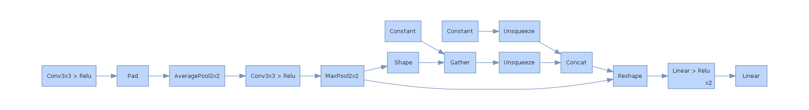

# 4.1 Visualization Of Network Structure

# 1. Code 

```python
import torch
import torch.nn as nn
import torchvision
import torchvision.utils as vutils
from torch.optim import  SGD
from  tqdm import  tqdm

import torch.utils.data as Data
from sklearn.metrics import  accuracy_score
import matplotlib.pyplot as plt

import os
os.environ["PATH"] += os.pathsep + 'D:/Program Files/Graphviz/bin'


def visualHiddenLayer(MyConvnet):
    import  hiddenlayer as hl

    hl_graph = hl.build_graph(MyConvnet,torch.zeros([1,1,28,28]))
    hl_graph.theme = hl.graph.THEMES['blue'].copy()
    print(hl_graph)
    hl_graph.save('4_1_1_Visualization-of-network-structure-using-HiddenLayer.png',format='png')

def visualViz(MyConvnet):
    from torchviz import make_dot
    x = torch.randn(1,1,28,28).requires_grad_(True)
    y = MyConvnet(x)
    MyConvnetvis = make_dot(y,params=dict(list(MyConvnet.named_parameters())+[('x',x)]))
    MyConvnetvis.format = 'png'
    # MyConvnetvis.directory = 'data/Image'
    MyConvnetvis.save('data/Images/4_1_2_MyConvnet_vis')
    MyConvnetvis.view()


def visualTensorboardX(MyConvnet):
    device = torch.device('cuda' if torch.cuda.is_available() else 'cpu')
    print(device)
    device = 'cpu'
    MyConvnet.to(device)
    MyConvnet.train()

    from tensorboardX import SummaryWriter

    SumWriter = SummaryWriter(log_dir='data/log')

    optimizer = torch.optim.Adam(MyConvnet.parameters(), lr=0.0003)
    loss_func = nn.CrossEntropyLoss()
    train_loss = 0
    print_step = 100

    for epoch in range(5):
        for step, (b_x, b_y) in tqdm(enumerate(train_loader), desc=f'Training at epoch {epoch}'):
            b_x = b_x.to(device)
            b_y = b_y.to(device)
            output = MyConvnet(b_x)
            loss = loss_func(output, b_y)
            optimizer.zero_grad()
            loss.backward()
            optimizer.step()
            train_loss = train_loss + loss
            niter = epoch * len(train_loader) + step + 1

            if niter % print_step == 0:
                SumWriter.add_scalar('train_loss', train_loss.item() / niter, global_step=niter)
                # test_data_x = test_data_x.to(device)
                # test_data_y = test_data_y.to(device)
                output = MyConvnet(test_data_x)
                output = output.to('cpu')
                _, pre_lab = torch.max(output, 1)
                acc = accuracy_score(test_data_y, pre_lab)
                SumWriter.add_scalar('test_acc', acc.item(), niter)
                b_x_im = vutils.make_grid(b_x, nrow=12)
                SumWriter.add_image('train_image sample', b_x_im, niter)

                for name, param in MyConvnet.named_parameters():
                    SumWriter.add_histogram(name, param.data.numpy(), niter)

def visualHiddenLayer(MyConvnet):
    import hiddenlayer as hl
    import time

    optimizer = torch.optim.Adam(MyConvnet.parameters(), lr=0.0003)
    loss_func = nn.CrossEntropyLoss()
    train_loss = 0
    print_step = 100
    # record criterion in the training process
    historyl = hl.History()
    # visualization using Canvas
    canvasl = hl.Canvas()
    
    for epoch in range(5):
        for step, (b_x, b_y) in tqdm(enumerate(train_loader)):
            # b_x,b_y = b_x.to(device),b_y.to(device)
            output = MyConvnet(b_x)
            loss = loss_func(output, b_y)
            optimizer.zero_grad()
            loss.backward()
            optimizer.step()
            train_loss = train_loss + loss
            # print(f'niter: {niter}: loss = {loss}, train_loss = {train_loss}')

            if step % print_step == 0:
                output = MyConvnet(test_data_x)
                _, pre_lab = torch.max(output, 1)
                acc = accuracy_score(test_data_y, pre_lab)
                historyl.log((epoch, step),
                             train_loss=loss,
                             test_acc=acc,
                             # weights of second fully connected layer
                             hidden_weight=MyConvnet.fc[2].weight)
                # visualize the training process
                with canvasl:
                    canvasl.draw_plot(historyl['train_loss'])
                    canvasl.draw_plot(historyl['test_acc'])
                    canvasl.draw_image(historyl['hidden_weight'])


dataset_path = 'data/Image'
train_data = torchvision.datasets.MNIST(
    root= dataset_path,
    train= True,
    transform= torchvision.transforms.ToTensor(),
    download= False
)


train_loader = Data.DataLoader(
    dataset= train_data,
    batch_size= 128,
    shuffle= True
)

test_data = torchvision.datasets.MNIST(
    root= dataset_path,
    train = False,
    download= False
)

train_data_x = train_data.train_data.type(torch.float32)/255.0
train_data_x = torch.unsqueeze(train_data_x,dim=1)
train_data_y = train_data.targets
# print('train_data_x.shape: ',train_data_x.shape)
# print('train_data_y.shape: ',train_data_y.shape)

test_data_x = test_data.test_data.type(torch.float32)/255.0
test_data_x = torch.unsqueeze(test_data_x,dim=1)
test_data_y = test_data.targets


# print('test_data_x.shape: ',test_data_x.shape)
# print('test_data_y.shape: ',test_data_y.shape)

class Convnet(nn.Module):
    def __init__(self):
        super(Convnet,self).__init__()
        self.conv1 = nn.Sequential(
            nn.Conv2d(
                in_channels= 1,
                out_channels= 16,
                kernel_size= 3,
                stride= 1,
                padding= 1,
            ),
            nn.ReLU(),
            nn.AvgPool2d(
                kernel_size= 2,
                stride= 2,
            )
        )
        self.conv2 = nn.Sequential(
            nn.Conv2d(16,32,3,1,1),
            nn.ReLU(),
            nn.MaxPool2d(2,2)
        )
        self.fc = nn.Sequential(
            nn.Linear(
                in_features=32*7*7,
                out_features=128
            ),
            nn.ReLU(),
            nn.Linear(128,64),
            nn.ReLU()
        )
        self.out = nn.Linear(64,10)
    def forward(self,x):
        x = self.conv1(x)
        x = self.conv2(x)
        x = x.view(x.size(0),-1)
        x = self.fc(x)
        output = self.out(x)
        return output

MyConvnet = Convnet()
print(MyConvnet)

# visualHiddenLayer(MyConvnet)
# visualViz(MyConvnet)
# visualTensorboardX(MyConvnet)
```

# 2. Illustration

## 2.1 Data And Model Preparation

Here we use MNIST dataset as example.

train_data_x.shape:  torch.Size([60000, 1, 28, 28])
train_data_y.shape:  torch.Size([60000])
test_data_x.shape:  torch.Size([10000, 1, 28, 28])
test_data_y.shape:  torch.Size([10000])


Print vision on structure of the network:

```python
Convnet(
  (conv1): Sequential(
    (0): Conv2d(1, 16, kernel_size=(3, 3), stride=(1, 1), padding=(1, 1))
    (1): ReLU()
    (2): AvgPool2d(kernel_size=2, stride=2, padding=0)
  )
  (conv2): Sequential(
    (0): Conv2d(16, 32, kernel_size=(3, 3), stride=(1, 1), padding=(1, 1))
    (1): ReLU()
    (2): MaxPool2d(kernel_size=2, stride=2, padding=0, dilation=1, ceil_mode=False)
  )
  (fc): Sequential(
    (0): Linear(in_features=1568, out_features=128, bias=True)
    (1): ReLU()
    (2): Linear(in_features=128, out_features=64, bias=True)
    (3): ReLU()
  )
  (out): Linear(in_features=64, out_features=10, bias=True)
)
```

## 2. Visualization Of Network Structure

## 2.1 HiddenLayer

- Visualization of network structure using HiddenLayer.



## 2.2 PytorchViz

- Visualization of network structure using PyTorchViz.


