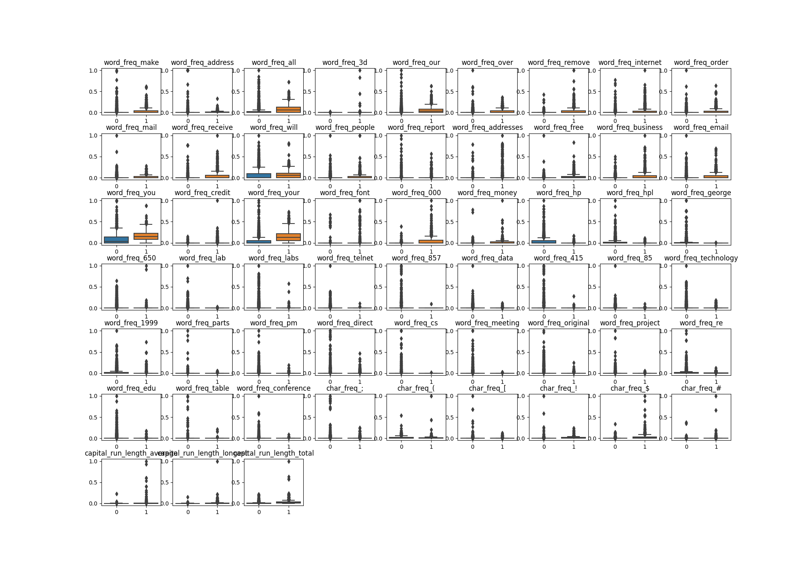
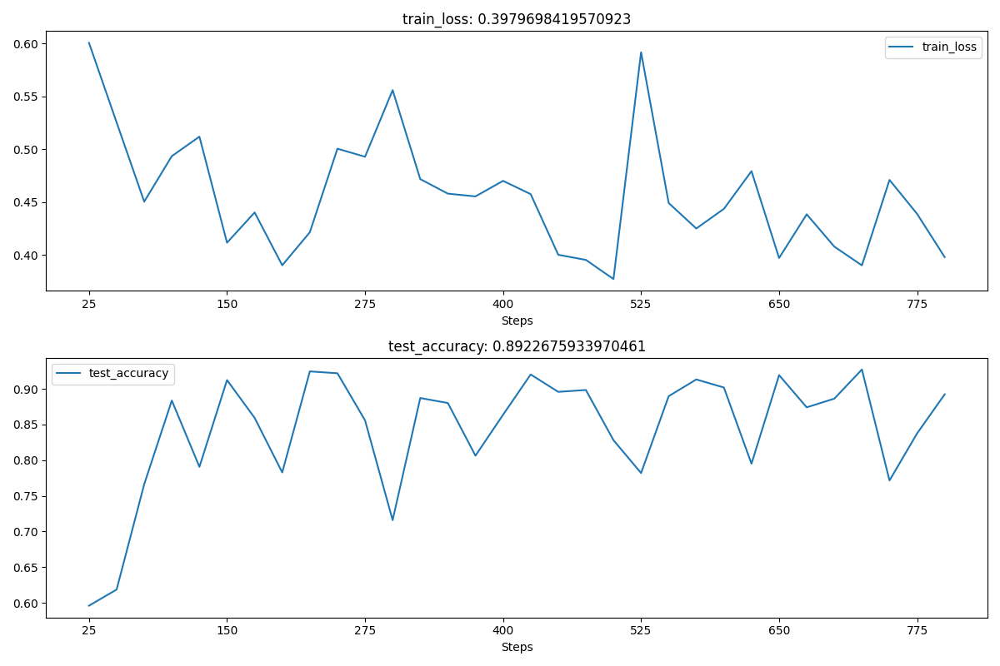
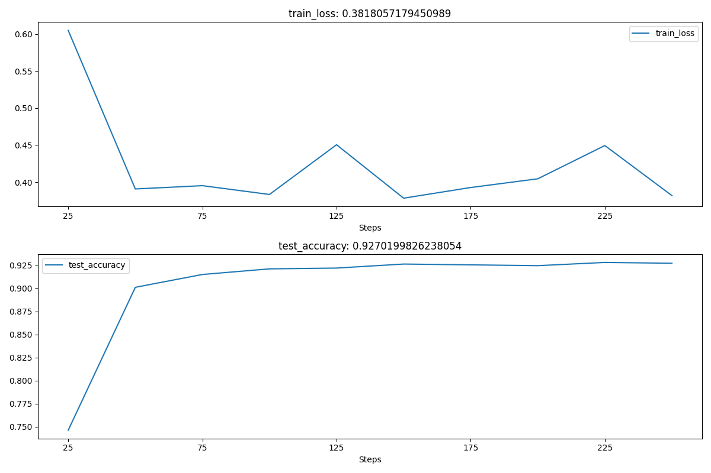
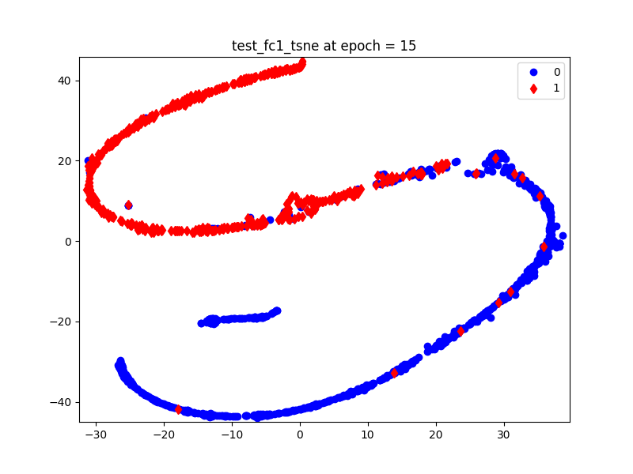
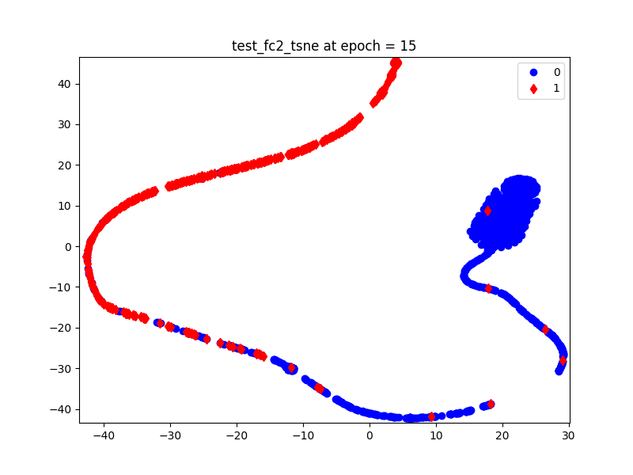
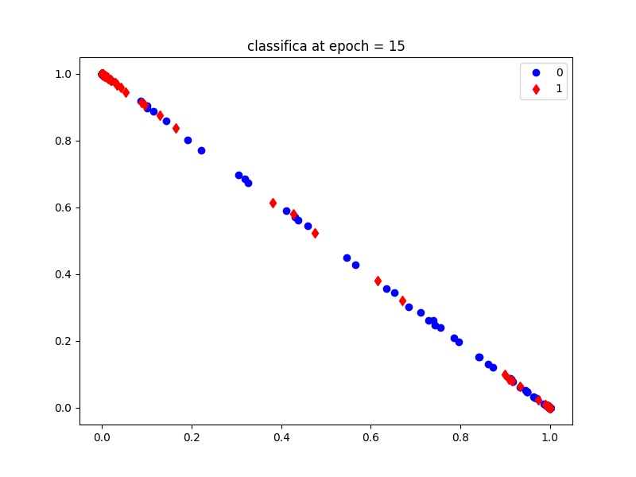

# 5.2 MLP Classification Model

# 1. Code

```python
import numpy as np
import pandas as pd
from sklearn.preprocessing import MinMaxScaler
from sklearn.model_selection import train_test_split
from sklearn.metrics import accuracy_score
from tqdm import tqdm

import torch
import torch.nn as nn
import torch.utils.data as Data
import matplotlib.pyplot as plt
import seaborn as sns
import hiddenlayer as hl
from torchviz import make_dot

# calculate

header = ['word_freq_make', 'word_freq_address', 'word_freq_all', 'word_freq_3d', 'word_freq_our', 'word_freq_over',
          'word_freq_remove', 'word_freq_internet', 'word_freq_order', 'word_freq_mail', 'word_freq_receive',
          'word_freq_will', 'word_freq_people', 'word_freq_report', 'word_freq_addresses', 'word_freq_free',
          'word_freq_business', 'word_freq_email', 'word_freq_you', 'word_freq_credit', 'word_freq_your',
          'word_freq_font', 'word_freq_000', 'word_freq_money', 'word_freq_hp', 'word_freq_hpl', 'word_freq_george',
          'word_freq_650', 'word_freq_lab', 'word_freq_labs', 'word_freq_telnet', 'word_freq_857', 'word_freq_data',
          'word_freq_415', 'word_freq_85', 'word_freq_technology', 'word_freq_1999', 'word_freq_parts', 'word_freq_pm',
          'word_freq_direct', 'word_freq_cs', 'word_freq_meeting', 'word_freq_original', 'word_freq_project',
          'word_freq_re', 'word_freq_edu', 'word_freq_table', 'word_freq_conference', 'char_freq_;', 'char_freq_(',
          'char_freq_[', 'char_freq_!', 'char_freq_$', 'char_freq_#', 'capital_run_length_average',
          'capital_run_length_longest', 'capital_run_length_total', 'label']

spam = pd.read_csv('data/chap5/spambase/spambase.csv')
head = spam.head(100)
print(head)

count = pd.value_counts(spam.label)
print(count)

# random split

X = spam.iloc[:, 0:57].values
y = spam.label.values
X_train, X_test, y_train, y_test = train_test_split(X, y, test_size=0.25, random_state=123)

# standardization
scales = MinMaxScaler(feature_range=(0, 1))
X_train_s = scales.fit_transform(X_train)
X_test_s = scales.transform(X_test)

# data visualization
def visData():
    # Display by boxplot
    colname = spam.columns.values[:-1]
    plt.figure(figsize=(20, 14))
    for ii in range(len(colname)):
        plt.subplot(7, 9, ii + 1)
        sns.boxplot(x=y_train, y=X_train_s[:, ii])
        plt.title(colname[ii])
    plt.subplots_adjust(hspace=0.4)
    plt.show()


# fully connected network
class MLPclassifica(nn.Module):
    def __init__(self):
        super(MLPclassifica, self).__init__()
        # First hidden layer
        self.hidden1 = nn.Sequential(
            nn.Linear(
                in_features=57,
                out_features=30,
                bias=True,
            ),
            nn.ReLU()
        )
        # second hidden layer
        self.hidden2 = nn.Sequential(
            nn.Linear(30, 10),
            nn.ReLU()
        )
        # classification layer
        self.classifica = nn.Sequential(
            nn.Linear(10, 2),
            nn.Sigmoid()
        )

    # Forward propagation
    def forward(self, x):
        fc1 = self.hidden1(x)
        fc2 = self.hidden2(fc1)
        output = self.classifica(fc2)
        # output two hidden layers and the output layer
        return fc1, fc2, output


# output the structure of the network
mlpc = MLPclassifica()
# print(mlpc)

# visualize using make_dot
x = torch.rand(1, 57).requires_grad_(True)
y = mlpc(x)

Mymlpcvis = make_dot(y, params=dict(list(mlpc.named_parameters()) + [('x', x)]))

# convert data into tensor
X_train_nots = torch.from_numpy(X_train.astype(np.float32))
y_train_t = torch.from_numpy(y_train.astype(np.int64))
X_test_nots = torch.from_numpy(X_test.astype(np.float32))
y_test_t = torch.from_numpy(y_test.astype(np.int64))

# combine X and Y
train_data_nots = Data.TensorDataset(X_train_nots, y_train_t)

# batch processing
train_nots_loader = Data.DataLoader(
    dataset=train_data_nots,
    batch_size=64,
    shuffle=True,
    # num_workers=1
)

# standardized

# Convert data into tensor
X_train_t = torch.from_numpy(X_train_s.astype(np.float32))
y_train_t = torch.from_numpy(y_train.astype(np.int64))
X_test_t = torch.from_numpy(X_test_s.astype(np.float32))
y_test_t = torch.from_numpy(y_test.astype(np.int64))

# Combine X and Y
train_data = Data.TensorDataset(X_train_t, y_train_t)

# Batch processing
train_loader = Data.DataLoader(
    dataset=train_data,
    batch_size=64,
    shuffle=True,
    # num_workers=1
)

# optimizer definition
optimizer = torch.optim.Adam(mlpc.parameters(), lr=0.01)
loss_func = nn.CrossEntropyLoss()  # cross entropy loss function for binary classification

# criteria
history1 = hl.History()

# visualization
canvas1 = hl.Canvas()
print_step = 25

# training iteratively
for epoch in range(15):
    # calculation for dataloader iteratively
    for step, (b_x, b_y) in tqdm(enumerate(train_loader)):
        # calculate loss of every batch
        _, _, output = mlpc(b_x)  # output on mlpc
        train_loss = loss_func(output, b_y)  # loss for binary classification
        optimizer.zero_grad()  # initialize gradient
        train_loss.backward()  # backward propagation for loss and calculate gradient
        optimizer.step()  # optimize using gradient
        niter = epoch * len(train_loader) + step + 1
        # calculate output after  iterates for print_step times
        if niter % print_step == 0:
            _, _, output = mlpc(X_test_t)
            _, pre_lab = torch.max(output,1)
            test_accuracy = accuracy_score(y_test_t,pre_lab)
            # add epoch, loss and precision for history
            history1.log(niter, train_loss=train_loss, test_accuracy=test_accuracy)

# visualize then loss function and precision by 2 figures
with canvas1:
    canvas1.draw_plot(history1['train_loss'])
    canvas1.draw_plot(history1['test_accuracy'])

# calculate the precision on the test set
_, _, output = mlpc(X_test_t)
_,pre_lab = torch.max(output,1)
test_accuracy = accuracy_score(y_test_t, pre_lab)
print('Test accuracy: ', test_accuracy)
```

This code does not contain codes on visualization of medium layer.


```python
X_train_s = scales.fit_transform(X_train)
X_test_s = scales.transform(X_test)
```

 and 58 attributes.
- Total instance: 4601
- Total attributes: 58
  - 48 continuous real [0,100] attributes of type word_freq_WORD 
    <br>= percentage of words in the e-mail that match WORD, i.e. 100 * (number of times the WORD appears in the e-mail) / total number of words in e-mail. A "word" in this case is any string of alphanumeric characters bounded by non-alphanumeric characters or end-of-string.
  - 6 continuous real [0,100] attributes of type char_freq_CHAR] 
    <br>= percentage of characters in the e-mail that match CHAR, i.e. 100 * (number of CHAR occurences) / total characters in e-mail
  - 1 continuous real [1,...] attribute of type capital_run_length_average 
    <br>= average length of uninterrupted sequences of capital letters
  - 1 continuous integer [1,...] attribute of type capital_run_length_longest 
    <br>= length of longest uninterrupted sequence of capital letters 
  - 1 continuous integer [1,...] attribute of type capital_run_length_total 
    <br>= sum of length of uninterrupted sequences of capital letters  
    <br>= total number of capital letters in the e-mail 
  - 1 nominal {0,1} class attribute of type spam 
    <br>= denotes whether the e-mail was considered spam (1) or not (0), i.e. unsolicited commercial e-mail.
  

Statistic on two classes of samples using pd.value_counts().

```python
    word_freq_make  word_freq_address  ...  capital_run_length_total  label
0             0.00               0.64  ...                       278      1
1             0.21               0.28  ...                      1028      1
2             0.06               0.00  ...                      2259      1
3             0.00               0.00  ...                       191      1
4             0.00               0.00  ...                       191      1
..             ...                ...  ...                       ...    ...
95            0.00               0.00  ...                        91      1
96            0.00               0.35  ...                       313      1
97            0.00               0.43  ...                       222      1
98            0.00               0.00  ...                       191      1
99            1.24               0.41  ...                       114      1
```

```python
[100 rows x 58 columns]
0    2788
1    1813
Name: label, dtype: int64
```

Here we get 1813 junk mail samples and 2788 non-junk mail samples.

Purely integer-location based indexing for selection by position.




### 2.1.2 Dataset Split

Splitting spam dataset by 75% for train set and 25% for test set.

Here we use ```train_test_split()```.

### 2.1.3 Standardization

Using MinMaxScaler to standardize data, transforming value of each feature to 0~1.

### 2.1.4 Visualization

Using boxplot to visualize every feature of train dataset.

Comparing data distribution of different classes of mails.

Some features show great differences on different kinds of mails, 
like word_freq_all, word_freq_our, word_freq_your, word_freq)you, word_freq_000, etc.

## 2.2 Model

### 2.2.1 Model Definition & Visualization

### 2.2.2 Training

Training model using unprocessed data.

The result of training and testing on non-standardized data is shown below.



The loss function is fluctuating and doesn't restrain.

Training model using standardized data.

As the figure showed below, the loss function restrains and the accuracy
reaches a high rate.



Test accuracy:  0.9357080799304952


### 2.2.3 Output medium layers

(1) When we need to output hidden layer in a forward propagation process, 
we can create a variable and output the variable.


When testing, we create ```test_fc2``` to output the medium layer/
```python
_,test_fc2 = mlpc (X_test_t)
print('test_fc2.shape: ', test_fc2.shape)
```

The output is ```torch.Size([1151, 10])```, represents 1151 samples with 10 features per sample.

Use ```visualHiddenLayer(test_fc2,x)``` function to visualize the hidden layer.

We can insert a block of code to visualize result of every 5 epochs:

Since we record the result every time ```niter % print_step == 0```, so the block will be inserted in this part.

```python
        # calculate output after  iterates for print_step times
        if niter % print_step == 0:
            if epoch % 5 == 0 or epoch == 14:
                mlpc.classifica.register_forward_hook(get_activation('classifica'))
            _, _, _ = mlpc(X_test_t)
            if epoch % 5 == 0:
                print('test_fc2.shape: ', test_fc2.shape)
                visualHiddenLayer(test_fc1,1)
                visualHiddenLayer(test_fc2,2)
            _, pre_lab = torch.max(output, 1)
            # test_accuracy = accuracy_score(y_test_t, pre_lab)
            # # add epoch, loss and precision for history
            # history1.log(niter, train_loss=train_loss, test_accuracy=test_accuracy)
```

The outputs are shown as following.





(2) Without medium variable, we can use **hook** technique.

Firstly, we need to define an auxiliary function.

```python
# auxiliary function definition, getting features of specific layers
activation = {} # save output of different layes
def get_activation(name):
    def hook(model, input, output):
        activation[name] = output.detach()
    return hook
```

After definition, we need to get outputs of medium layers and save in the form of dictionary in **activation**.

The process goes as following:

- Get the output of classification layer.
- Applying mlpc on test set X_test_t.
- Key value activation\[classfica] will be the target medium feature,
according to the output, every sample contains two feature outputs.

Meanwhile, we need to insert a block of code in every test process:

```python
        # calculate output after  iterates for print_step times
        if niter % print_step == 0:
            if epoch == 15:
                mlpc.classifica.register_forward_hook(get_activation('classifica'))
            _, test_fc1, test_fc2 = mlpc(X_test_t)
            if epoch == 15:
                classifica = activation['classifica']
                print('classifica.shape: ', classifica.shape)
                visualHook(classifica,epoch)
```

We can also use ```visualC``` to draw a scatter.




