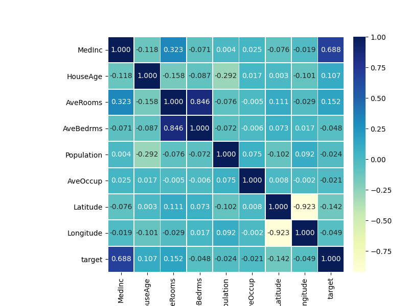
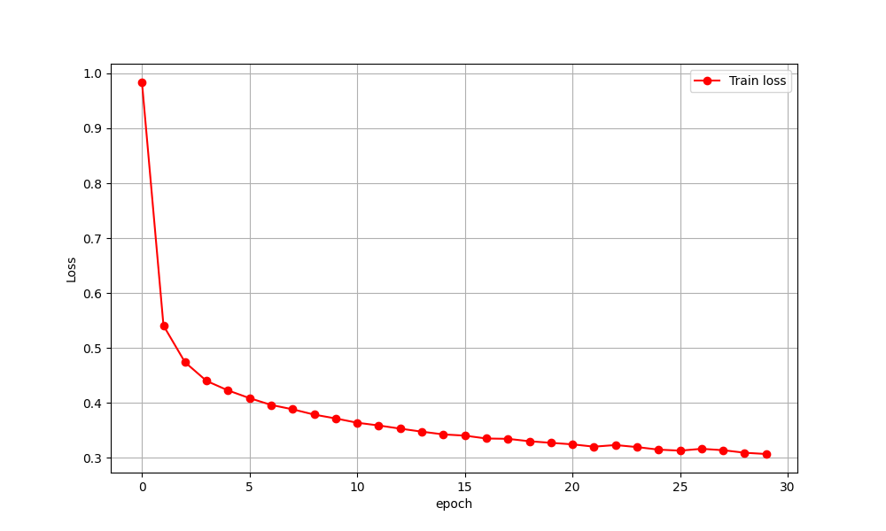

# 5.3 MLP Regression

# 1. Code

```python
import numpy as np
import pandas as pd
from sklearn.preprocessing import StandardScaler
from sklearn.model_selection import train_test_split
from sklearn.metrics import mean_absolute_error
from sklearn.datasets import fetch_california_housing

import torch
import torch.nn as nn
import torch.nn.functional as F
import torch.utils.data as Data
import matplotlib.pyplot as plt
import seaborn as sns
from tqdm import tqdm

def visualData():
    housedatadf = pd.DataFrame(data=X_train_s, columns=house_data.feature_names)
    housedatadf['target'] = y_train

    datacor = np.corrcoef(housedatadf.values, rowvar=0)
    datacor = pd.DataFrame(data=datacor, columns=housedatadf.columns,
                           index=housedatadf.columns)
    plt.figure(figsize=(8, 6))
    ax = sns.heatmap(datacor, square=True, annot=True, fmt='.3f',
                     linewidth=.5, cmap='YlGnBu',
                     cbar_kws={'fraction': 0.046, 'pad': 0.03})
    plt.show()


def visualLoss(train_loss_all):
    plt.figure(figsize=(10, 6))
    plt.plot(train_loss_all, 'ro-', label='Train loss')
    plt.legend()
    plt.grid()
    plt.xlabel('epoch')
    plt.ylabel('Loss')
    plt.show()

def visualDiff(y_test):
    index = np.argsort(y_test)
    plt.figure(figsize=(12,5))
    plt.plot(np.arange(len(y_test)),y_test[index],'r',label='Original Y')
    plt.scatter(np.arange(len(pre_y)),pre_y[index], s=3, c='b',label='Prediction')
    plt.legend(loc = 'upper left')
    plt.grid()
    plt.xlabel('Index')
    plt.ylabel('Y')
    plt.show()


house_data = fetch_california_housing()

X_train, X_test, y_train, y_test = train_test_split(
    house_data.data, house_data.target, test_size=0.3, random_state=42
)

scale = StandardScaler()
X_train_s = scale.fit_transform(X_train)
X_test_s = scale.transform(X_test)

# convert data to tensor
train_xt = torch.from_numpy(X_train_s.astype(np.float32))
train_yt = torch.from_numpy(y_train.astype(np.float32))
test_xt = torch.from_numpy(X_test_s.astype(np.float32))
test_yt = torch.from_numpy(y_test.astype(np.float32))

# dataloader processing
train_data = Data.TensorDataset(train_xt, train_yt)
test_data = Data.TensorDataset(test_xt, test_yt)
train_loader = Data.DataLoader(dataset=train_data, batch_size=64,
                               shuffle=True,
                               # num_workers=1
                               )


# fully connected network
class MLPregression(nn.Module):
    def __init__(self):
        super(MLPregression, self).__init__()
        # first hidden layer
        self.hidden1 = nn.Linear(in_features=8,
                                 out_features=100, bias=True)
        # second hidden layer
        self.hidden2 = nn.Linear(100, 100)
        # third hidden layer
        self.hidden3 = nn.Linear(100, 50)
        # Prediction layer
        self.predict = nn.Linear(50, 1)

    def forward(self, x):
        x = F.relu(self.hidden1(x))
        x = F.relu(self.hidden2(x))
        x = F.relu(self.hidden3(x))
        output = self.predict(x)
        # output an one-dimension vector
        return output[:, 0]


# output the structure of the network
mlpreg = MLPregression()
print(mlpreg)

# training

# optimizer definition
optimizer = torch.optim.SGD(mlpreg.parameters(), lr=0.01)
loss_func = nn.MSELoss()  # mean square root loss function
train_loss_all = []

# training iteratively for epoch times for all data
for epoch in range(30):
    train_loss = 0
    train_num = 0
    # iteratively calculating data in train dataloader
    for step, (b_x, b_y) in tqdm(enumerate(train_loader)):
        output = mlpreg(b_x)  # output of MLP on a batch
        loss = loss_func(output, b_y)  # Mean square root loss function
        optimizer.zero_grad()  # initialize every iterative step to be 0
        loss.backward()  # loss backward propagation, calculating gradients
        optimizer.step()  # optimize using gradients
        train_loss += loss.item() * b_x.size(0)
        train_num += b_x.size(0)
    train_loss_all.append(train_loss / train_num)

# visualize loss in the training process
visualLoss(train_loss_all)

# predict on test set
pre_y = mlpreg(test_xt)
pre_y = pre_y.data.numpy()

mae = mean_absolute_error(y_test, pre_y)

print('Absolute error on test set is: ',mae)

# visualize difference between original data and prediction
visualDiff(y_test)
```

# 2. Illustration

Since most of this section is the similar with the classification process, only fresh code will be explicated.

## 2.1 Data Preprocessing

### 2.1.1 Data Distribution

Here we use the data set **California Housing** for prediction.

Source website: [California Housing](https://www.dcc.fc.up.pt/~ltorgo/Regression/cal_housing.html)

Statistic features are shown as following.

- Total samples: 20640 instances where each instance contains 8 independent attributes
and 1 dependent attribute, which is the median value of a house in a block.
- Independent attributes:
    - INTERCEPT
    - MEDIAN INCOME
    - MEDIAN INCOME2
    - MEDIAN INCOME3
    - ln(MEDIAN AGE)
    - ln(TOTAL ROOMS/ POPULATION)
    - ln(BEDROOMS/ POPULATION)
    - ln(POPULATION/ HOUSEHOLDS)
    - ln(HOUSEHOLDS)
- Dependent attribute: ln(median house value)

### 2.1.2 Visualization Using Heatmap

We can use heatmap to calculate the correlation in 9 attributes.

The heatmap is shown as following.



From the figure, we can get that the variable which most related to target variable is MedInc(Median Income),
while AveRooms and AveBedrms have a strong positive correlation.

## 2.2 Model

### 2.2.1 Model Definition & Visualization

The structure of the model is shown as following.

```python
MLPregression(
  (hidden1): Linear(in_features=8, out_features=100, bias=True)
  (hidden2): Linear(in_features=100, out_features=100, bias=True)
  (hidden3): Linear(in_features=100, out_features=50, bias=True)
  (predict): Linear(in_features=50, out_features=1, bias=True)
)
```

### 2.2.2 Training

Here we use SGD as optimizer and mean square loss function to train the model.

We can use ```visualLoss``` to visualize the loss during training process.



### 2.2.3 Prediction

Here we make prediction on our net and set criteria as average absolute loss.

We can also use ```visualDiff``` to visualize difference between original samples and predictions.

Absolute error on test set is:  0.3907996601340167


