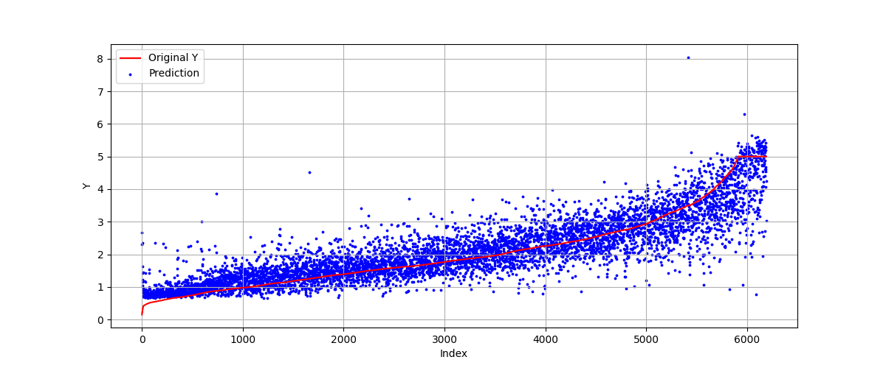

# 5.3 MLP Regression

# 1. Code


# 2. Illustration

Since most of this section is the similar with the classification process, only fresh code will be explicated.

## 2.1 Data Preprocessing

### 2.1.1 Data Distribution

Here we use the data set **California Housing** for prediction.

Source website: [California Housing](https://www.dcc.fc.up.pt/~ltorgo/Regression/cal_housing.html)

Statistic features are shown as following.

- Total samples: 20640 instances where each instance contains 8 independent attributes
and 1 dependent attribute, which is the median value of a house in a block.
- Independent attributes:
    - INTERCEPT
    - MEDIAN INCOME
    - MEDIAN INCOME2
    - MEDIAN INCOME3
    - ln(MEDIAN AGE)
    - ln(TOTAL ROOMS/ POPULATION)
    - ln(BEDROOMS/ POPULATION)
    - ln(POPULATION/ HOUSEHOLDS)
    - ln(HOUSEHOLDS)
- Dependent attribute: ln(median house value)

### 2.1.2 Visualization Using Heatmap

We can use heatmap to calculate the correlation in 9 attributes.

The heatmap is shown as following.


From the figure, we can get that the variable which most related to target variable is MedInc(Median Income),
while AveRooms and AveBedrms have a strong positive correlation.

## 2.2 Model

### 2.2.1 Model Definition & Visualization

The structure of the model is shown as following.

```python
MLPregression(
  (hidden1): Linear(in_features=8, out_features=100, bias=True)
  (hidden2): Linear(in_features=100, out_features=100, bias=True)
  (hidden3): Linear(in_features=100, out_features=50, bias=True)
  (predict): Linear(in_features=50, out_features=1, bias=True)
)
```

### 2.2.2 Training

Here we use SGD as optimizer and mean square loss function to train the model.

We can use ```visualLoss``` to visualize the loss during training process.


### 2.2.3 Prediction

Here we make prediction on our net and set criteria as average absolute loss.

Absolute error on test set is:  0.3907996601340167




