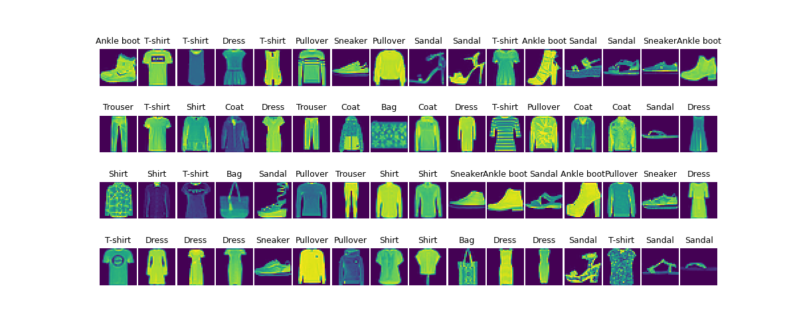
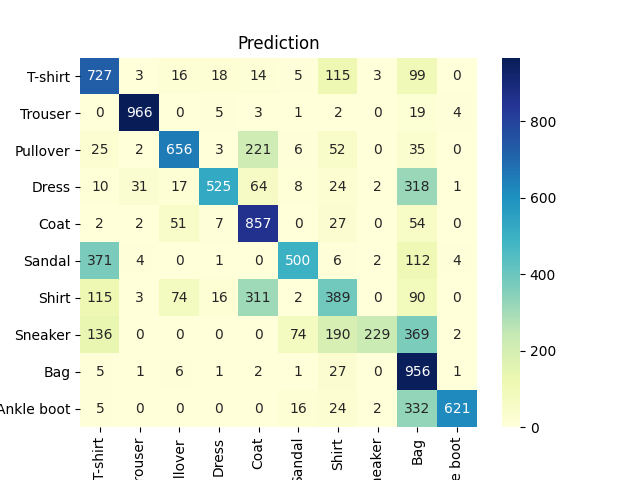

# 6.3 Fashion MNIST Based On CNN

# 1. Code

```python
import numpy as np
import pandas as pd
from sklearn.metrics import accuracy_score, confusion_matrix, classification_report
import matplotlib.pyplot as plt
import seaborn as sns
import copy
import time
from tqdm import tqdm

import torch
import torch.nn as nn
from torch.optim import Adam
import torch.utils.data as Data
from torchvision import transforms
from torchvision.datasets import FashionMNIST

def visualImagesPerBatch(b_x, b_y):
    batch_x = b_x.squeeze().numpy()
    batch_y = b_y.numpy()
    class_label = train_data.classes
    class_label[0] = 'T-shirt'
    plt.figure(figsize=(12, 5))
    for ii in np.arange(len(batch_y)):
        plt.subplot(4, 16, ii + 1)
        plt.imshow(batch_x[ii, :, :], )
        plt.title(class_label[batch_y[ii]], size=9)
        plt.axis('off')
        plt.subplots_adjust(wspace=0.05)
    plt.show()

def visualLossAndAccuracy(train_process):
    plt.figure(figsize=(12,4))

    plt.subplot(1,2,1)
    plt.plot(train_process.epoch,train_process.train_loss_all,
             'ro-',label='Train loss')
    plt.plot(train_process.epoch, train_process.val_loss_all,
             'bs-',label='Val loss')
    plt.legend()
    plt.xlabel('epoch')
    plt.ylabel('Loss')

    plt.subplot(1,2,2)
    plt.plot(train_process.epoch, train_process.train_acc_all,
             'bs-',label='Train acc')
    plt.plot(train_process.epoch, train_process.val_acc_all,
             'bs-', label = 'Val acc')
    plt.xlabel('epoch')
    plt.ylabel('acc')
    plt.legend()
    plt.show()

def visualPrediction(test_data_y, pre_lab,class_label):
    conf_mat = confusion_matrix(test_data_y,pre_lab)
    df_cm = pd.DataFrame(conf_mat,index=class_label,
                         columns=class_label)
    heatmap = sns.heatmap(df_cm, annot=True, fmt='d',cmap='YlGnBu')
    heatmap.yaxis.set_ticklabels(heatmap.yaxis.get_ticklabels(),rotation=0,ha='right')
    plt.ylabel('True label')
    plt.xlabel('Predicted label')
    plt.show()


# data loading
train_data = FashionMNIST(
    root='./data/Image',
    train=True,
    transform=transforms.ToTensor(),
    download=False
)

# data loader
train_loder = Data.DataLoader(
    dataset=train_data,
    batch_size=64,
    shuffle=False,
    # num_workers= 2,
)

# calculate batch in the train_loader
print('Number of batch in the train_loader is: ', len(train_loder))

# get data in a batch
for step, (b_x, b_y) in enumerate(train_loder):
    # visualize images in a batch
    # visualImagesPerBatch(b_x, b_y)
    if step == 0:
        break

# process test set
test_data = FashionMNIST(
    root= './data/Image',
    train=False,
    download=False
)

# add a channel and scale value into n0~1
test_data_x = test_data.data.type(torch.FloatTensor)
test_data_x = torch.unsqueeze(test_data_x, dim=1)
test_data_y = test_data.targets
print('test_data_x.shape: ',test_data_x.shape)
print('test_data_y.shape: ',test_data_y.shape)


class MyConvNet(nn.Module):
    def __init__(self):
        super(MyConvNet, self).__init__()
        # first convolutional layer
        self.conv1 = nn.Sequential(
            nn.Conv2d(
                in_channels=1,
                out_channels=16,
                kernel_size=3,
                stride=1,
                padding=1,
            ),
            nn.ReLU(),
            nn.AvgPool2d(
                kernel_size=2,
                stride=2,
            )
        )
        self.conv2 = nn.Sequential(
            nn.Conv2d(16, 32, 3, 1, 0),
            nn.ReLU(),
            nn.AvgPool2d(2, 2)
        )
        self.classifier = nn.Sequential(
            nn.Linear(32 * 6 * 6, 256),
            nn.ReLU(),
            nn.Linear(256, 128),
            nn.ReLU(),
            nn.Linear(128, 10)
        )

    def forward(self, x):
        x = self.conv1(x)
        x = self.conv2(x)
        x = x.view(x.size(0), -1)
        output = self.classifier(x)
        return output


# output the structure of net
myconvnet = MyConvNet()


# print(myconvnet)

# Training

def train_model(model, train_dataloader, train_rate, criterion, optimizer, num_epochs=25):
    # calculate number of batches
    batch_num = len(train_dataloader)
    train_batch_num = round(batch_num * train_rate)
    # copy parameters of the model
    best_model_wts = copy.deepcopy(model.state_dict())
    best_acc = 0.0
    train_loss_all = []
    train_acc_all = []
    val_loss_all = []
    val_acc_all = []
    since = time.time()
    for epoch in range(1,num_epochs+1):
        print('Epoch {}/{}'.format(epoch, num_epochs))
        print('-' * 10)
        # two stages in every epoch
        train_loss = 0.0
        train_corrects = 0
        train_num = 0
        val_loss = 0.0
        val_num = 0
        val_corrects = 0
        for step, (b_x, b_y) in tqdm(enumerate(train_dataloader)):
            if step < train_batch_num:
                model.train()
                output = model(b_x)
                pre_lab = torch.argmax(output, 1)
                loss = criterion(output, b_y)
                optimizer.zero_grad()
                loss.backward()
                optimizer.step()
                train_loss = loss.item() * b_x.size(0)
                train_corrects += torch.sum(pre_lab == b_y.data)
                train_num += b_x.size(0)
            else:
                model.eval()
                output = model(b_x)
                pre_lab = torch.argmax(output, 1)
                loss = criterion(output, b_y)
                val_loss += loss.item() * b_x.size(0)
                val_corrects += torch.sum(pre_lab == b_y.data)
                val_num += b_x.size(0)
        # compute loss and accuracy in an epoch
        train_loss_all.append(train_loss / train_num)
        train_acc_all.append(train_corrects.double().item() / train_num)
        val_loss_all.append(val_loss / val_num)
        val_acc_all.append(val_corrects.double().item() / val_num)
        print('{} Train Loss: {:.4f} Train Acc: {:.4f}'.format(
            epoch, train_loss_all[-1], train_acc_all[-1]
        ))
        print('{} Val Loss: {:.4f} Train Acc: {:.4f}'.format(
            epoch, val_loss_all[-1], val_acc_all[-1]
        ))

        # copy parameters of highest accuracy for the model
        if val_acc_all[-1] > best_acc:
            best_acc = val_acc_all[-1]
            best_model_wts = copy.deepcopy(model.state_dict())
        time_use = time.time() - since
        print('Train and val complete in {:.0f}m {:.0f}s'.format(
            time_use // 60, time_use % 60
        ))

    # use parameters of the best model
    model.load_state_dict(best_model_wts)
    train_process = pd.DataFrame(
        data={'epoch': range(num_epochs),
              'train_loss_all': train_loss_all,
              'val_loss_all': val_loss_all,
              'train_acc_all': train_loss_all,
              'val_acc_all': val_acc_all})
    return model, train_process


# training process
optimizer = torch.optim.Adam(myconvnet.parameters(), lr=0.0003)
criterion = nn.CrossEntropyLoss()
myconvnet, train_process = train_model(
    myconvnet, train_loder, 0.8,
    criterion, optimizer, num_epochs=10
)

# visualize training process
visualLossAndAccuracy(train_process)

# prediction on test set and visualize
myconvnet.eval()
output = myconvnet(test_data_x)
pre_lab = torch.argmax(output,1)
acc = accuracy_score(test_data_y, pre_lab)
print('Accuracy on test set is: ',acc)

# visualize testing process
class_label = test_data.classes
visualPrediction(test_data_y,pre_lab,class_label)
```

# 2. Illustration


Number of batch in the train_loader is:  938

test_data_x.shape:  torch.Size([10000, 1, 28, 28])

test_data_y.shape:  torch.Size([10000])

class_label = ['T-shirt/top', 'Trouser', 'Pullover', 'Dress', 'Coat', 'Sandal', 'Shirt', 'Sneaker', 'Bag', 'Ankle boot']

class_label = ['T-shirt', 'Trouser', 'Pullover', 'Dress', 'Coat', 'Sandal', 'Shirt', 'Sneaker', 'Bag', 'Ankle boot']

Structure of the network:

```python
MyConvNet(
  (conv1): Sequential(
    (0): Conv2d(1, 16, kernel_size=(3, 3), stride=(1, 1), padding=(1, 1))
    (1): ReLU()
    (2): AvgPool2d(kernel_size=2, stride=2, padding=0)
  )
  (conv2): Sequential(
    (0): Conv2d(16, 32, kernel_size=(3, 3), stride=(1, 1))
    (1): ReLU()
    (2): AvgPool2d(kernel_size=2, stride=2, padding=0)
  )
  (classifier): Sequential(
    (0): Linear(in_features=1152, out_features=256, bias=True)
    (1): ReLU()
    (2): Linear(in_features=128, out_features=10, bias=True)
  )
)
```

For details in training and testing, please check in the code.

Accuracy on test set is:  0.6426

Images in a batch:



Heatmap on prediction:



