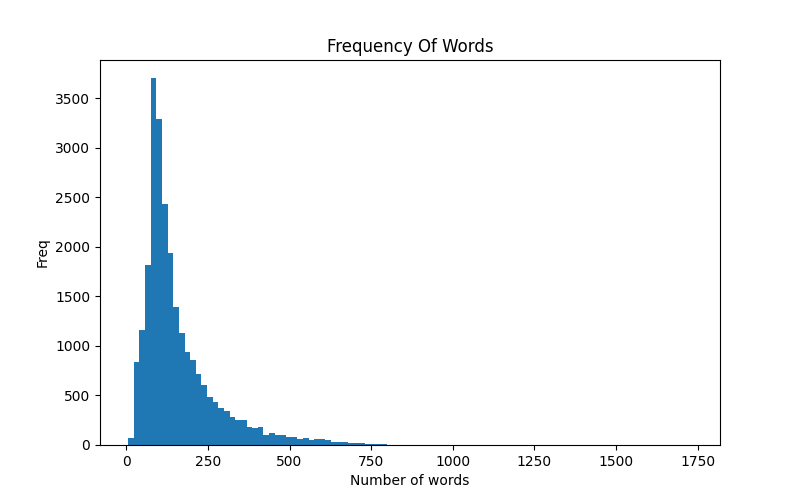

# 6.5 Sentiment Analysis Based On CNN

# 1. Code


## 1.1 Data Preprocessing
```python
import numpy as np
import pandas as pd
import matplotlib.pyplot as plt
import os
import re
import string
import nltk
from nltk.corpus import stopwords
from nltk.tokenize import word_tokenize
from nltk.stem import PorterStemmer

import seaborn as sns
from wordcloud import WordCloud
import time
import copy
from tqdm import tqdm

import torch
import torch.nn.functional as F
import torch.optim as optim
from torchvision import transforms
from torchtext import data
from torchtext.vocab import Vectors, GloVe


def save_to_csv(train_text_pre2, test_text_pre2):
    texts = [' '.join(words) for words in train_text_pre2]
    train_data_save = pd.DataFrame({'text': texts,
                                    'label': train_label})
    texts = [' '.join(words) for words in test_text_pre2]
    test_data_save = pd.DataFrame({'text': texts,
                                   'label': test_label})
    train_data_save.to_csv('data/Text/imdb/imdb_train_preprocessed.csv',index=False)
    test_data_save.to_csv('data/Text/imdb/imdb_test_preprocessed.csv',index=False)

def visualWordLength(word_num):
    plt.figure(figsize=(8,5))
    _ = plt.hist(word_num,bins=100)
    plt.title('Frequency Of Words')
    plt.xlabel('Number of words')
    plt.ylabel('Freq')
    plt.show()

def visualWordCloud(train_data,train_label):
    plt.figure(figsize=(16,10))
    for ii in np.unique(train_label):
        # prepare all words of each class of sentiment
        text = np.array(train_data.train_word[train_data.train_label==ii])
        text = ' '.join(np.concatenate(str(text)))
        plt.subplot(1,2,ii+1)
        # generate word cloud
        word_cloud = WordCloud(margin=5, width=1800,height=1000,
                               max_words=500,min_font_size=5,
                               background_color='white',
                               max_font_size=250)
        word_cloud.generate_from_text(text)
        if ii == 1:
            plt.title('Positive')
        else:
            plt.title('Negative')
        plt.subplots_adjust(wspace=0.05)
    plt.show()


# preprocessing
def load_text_data(path):
    text_data = []
    label = []
    for dset in ['pos', 'neg']:
        path_dset = os.path.join(path, dset)
        path_list = os.listdir(path_dset)
        for fname in path_list:
            if fname.endswith('.txt'):
                filename = os.path.join(path_dset, fname)
                with open(filename) as f:
                    text_data.append(f.read())
            if dset == 'pos':
                label.append(1)
            else:
                label.append(0)
    return np.array(text_data), np.array(label)


train_path = 'data/Text/imdb/train.csv'
test_path = 'data/Text/imdb/test.csv'


def load_data_new(path):
    text_data = pd.read_csv(train_path)
    pos_sample = []
    neg_sample = []
    sentence = text_data.sentence
    label = text_data.label
    for line in tqdm(range(len(label)), desc='Loading data: '):
        if label[line] == 0:
            neg_sample.append([sentence[line], label[line]])
        elif label[line] == 1:
            pos_sample.append([sentence[line], label[line]])
    all_sample = neg_sample + pos_sample
    text_data_n = np.array(all_sample)
    return text_data_n[:, 0], text_data_n[:, 1]


train_text, train_label = load_data_new(train_path)
test_text, test_label = load_data_new(test_path)
print(len(train_text), len(train_label))
print(len(test_text), len(test_label))

# clear specific characters
def text_preprocess(text_data):
    text_pre = []
    for text1 in tqdm(text_data, desc='Text preprocessing: '):
        text1 = re.sub('<br /><br />', ' ', text1)
        text_pre.append(text1)
    return np.array(text_pre)


train_text_pre = text_preprocess(train_text)
test_text_pre = text_preprocess(test_text)


# text symbolization, stop words clearance
def stop_stem_word(datalist, stop_words):
    datalist_pre = []
    for text in tqdm(datalist, desc='Symbolization and stop word clearance: '):
        text_words = word_tokenize(text)
        # clear stop words
        text_words = [word for word in text_words if not word in stop_words]
        # delete words with "'", like 'it's'
        text_words = [word for word in text_words if len(re.findall('\'', word)) == 0]
        datalist_pre.append(text_words)
    return np.array(datalist_pre)


stop_words = stopwords.words('english')
stop_words = set(stop_words)
train_text_pre2 = stop_stem_word(train_text_pre, stop_words)
test_text_pre2 = stop_stem_word(test_text_pre, stop_words)

# print(train_text_pre[10000])
# print('='*10)
# print(train_text_pre2[10000])

# save preprocessed text into csv file
# save_to_csv(train_text_pre2,test_text_pre2)

# convert preprocessed text data into diagram
train_data = pd.DataFrame({'train_text': train_text,
                           'train_word': train_text_pre2,
                           'train_label': train_label})

# statistic on frequency of every word
train_word_num = [len(text) for text in train_text_pre2]
train_data['train_word_num'] = train_word_num

# visualize distribution of word length
visualWordLength(train_word_num)

# display by word cloud to visualize frequency difference of two classes
visualWordCloud(train_data,train_label)
```


## 1.2 Data Preparation and Training

```python

import time
import copy
from tqdm import tqdm

import torch
import torch.nn as nn
import torch.nn.functional as F
import torch.optim as optim
from torchvision import transforms
from torchtext.legacy import data
from torchtext.vocab import Vectors, GloVe

# data preparation using torchtext

# split method definition
mytokenize = lambda x: x.split()

TEXT = data.Field(sequential=True, tokenize=mytokenize,
                  include_lengths=True,use_vocab=True,
                  batch_first=True, fix_length=200)

LABEL = data.Field(sequential=False,use_vocab=False,
                   pad_token=None, unk_token=None)

# column processing on dataset
train_test_fields = [
    ('text',TEXT),
    ('label', LABEL)
]

# data loading
train_data, test_data = data.TabularDataset.splits(
    path = 'data/Text/imdb',format='csv',
    train = 'imdb_train_preprocessed.csv', fields=train_test_fields,
    test='imdb_test_preprocessed.csv',skip_header=True
)

print(len(train_data),len(test_data))

# ex0 = train_data.examples[0]
# print(ex0.label)
# print(ex0.text)

# split dataset by 70% for training set and 30% for validation set
train_data, val_data = train_data.split(split_ratio=0.7)
print('Training set: ',len(train_data))
print('Validation set:',len(val_data))

# load pretrained word vector and construct vocabulary
vec = Vectors('glove.6B.100d.txt','./data/Model')

# convert training set into word vector
# construct vocabulary using training set
# load pretrained word vector
TEXT.build_vocab(train_data,max_size=20000,vectors=vec)
LABEL.build_vocab(train_data)
print('Number of Labels: ',LABEL.vocab.freqs)
# top 10 most common words in training set
print(TEXT.vocab.freqs.most_common(n=10))
print('Number of words: ',len(TEXT.vocab.itos))
print('Top 10 most common words: \n', TEXT.vocab.itos[0:10])

# number and classes of labels
print('Labels: ',LABEL.vocab.freqs)

# Dataloader definition
BATCH_SIZE = 32
train_iter = data.BucketIterator(train_data,batch_size=BATCH_SIZE)
val_iter = data.BucketIterator(val_data,batch_size=BATCH_SIZE)
test_iter = data.BucketIterator(test_data,batch_size=BATCH_SIZE)

# data in a batch
for step, batch in enumerate(train_iter):
    # get labels in a batch
    print('Labels in a batch: ', batch.label.shape)
    # get token vector of text
    print('Size of a token: ',batch.text[0].shape)
    # get number of samples
    print('Number of samples: ', len(batch.text[1]))
    if step == 0:
        break

class CNN_Text(nn.Module):
    def __init__(self,vocab_size, embedding_dim, n_filters,
                 filer_sizes, output_dim,
                 dropout, pad_idx):
        super(CNN_Text,self).__init__()
        self.embedding = nn.Embedding(vocab_size,embedding_dim,
                                      padding_idx=pad_idx)
        self.convs = nn.ModuleList([
            nn.Conv2d(in_channels=1,out_channels=n_filters,
                      kernel_size=(fs,embedding_dim)) for fs in filer_sizes
        ])
        self.fc = nn.Linear(len(filer_sizes)*n_filters,output_dim)
        self.dropout = nn.Dropout(dropout)

    def forward(self,text):
        embedded = self.embedding(text)
        embedded = embedded.unsqueeze(1)
        conved = [F.relu(conv(embedded)).squeeze(3) for conv in self.convs]
        pooled = [F.max_pool1d(conv,conv.shape[2]).squeeze(2) for conv in conved]
        cat = self.dropout(torch.cat(pooled,dim=1))
        return self.fc(cat)

INPUT_DIM = len(TEXT.vocab)
EMBEDDING_DIM = 100
N_FILTERS = 100
FILTER_SIZES = [3,4,5]
OUTPUT_DIM = 1
DROPOUT = 0.5
PAD_IDX = TEXT.vocab.stoi[TEXT.pad_token]
model = CNN_Text(INPUT_DIM,EMBEDDING_DIM,N_FILTERS,FILTER_SIZES,
                 OUTPUT_DIM,DROPOUT,PAD_IDX)
# device = 'cuda' if torch.cuda.is_available() else 'cpu'
# print(device)

# training and prediction

# weight initialization by word vector
pretrained_embeddings = TEXT.vocab.vectors
model.embedding.weight.data.copy_(pretrained_embeddings)
# initialize words like '<unk>', '<pad>' as 0
UNK_IDX = TEXT.vocab.stoi[TEXT.unk_token]
model.embedding.weight.data[UNK_IDX] = torch.zeros(EMBEDDING_DIM)
model.embedding.weight.data[PAD_IDX] = torch.zeros(EMBEDDING_DIM)

# optimizer and criterion definition
optimizer = optim.Adam(model.parameters())
criterion = nn.BCEWithLogitsLoss()

# loss and accuracy recorder
loss_all = []
acc_all = []

# train in 1 epoch
def train_epoch(model, iterator, optimizer, criterion,epoch):
    epoch_loss = 0
    epoch_acc =0
    train_corrects = 0; train_num = 0
    model.train()
    for batch in tqdm(iterator,desc=f'Training at epoch = {epoch}: '):
        optimizer.zero_grad()
        pre = model(batch.text[0]).squeeze(1)
        loss = criterion(pre, batch.label.type(torch.FloatTensor))
        pre_lab = torch.round(torch.sigmoid(pre))
        batch_lab = torch.round(torch.sigmoid(batch.label))
        #train_corrects += torch.sum(pre_lab==batch_lab)
        train_corrects += torch.sum(pre_lab == batch.label)
        train_num += len(batch.label) # number of instances
        loss.backward()
        optimizer.step()
        epoch_loss += loss.item()
        loss_all.append(loss.item())
    # average loss and accuracy for all instances
    epoch_loss = epoch_loss / train_num
    print('Epoch_loss is: ',epoch_loss )
    epoch_acc = train_corrects.double().item() / train_num
    return epoch_loss, epoch_acc

# validate in 1 epoch
def evaluate(model, iterator, criterion,epoch):
    pattern = 'Validating'
    if epoch == 1:
        pattern = 'Testing'
    epoch_loss = 0; epoch_acc = 0
    train_corrects = 0; train_num = 0
    model.eval()
    with torch.no_grad():
        for batch in tqdm(iterator,desc=f'{pattern} at epoch = {epoch}: '):
            pre = model(batch.text[0]).squeeze(1)
            loss = criterion(pre, batch.label.type(torch.FloatTensor))
            pre_lab = torch.tensor(torch.round(torch.sigmoid(pre)))
            batch_lab = torch.tensor(torch.round(torch.sigmoid(batch.label)))
            #train_corrects += torch.sum(pre_lab.long() == batch_lab)
            train_corrects += torch.sum(pre_lab.long() == batch.label) # number of instances
            train_num += len(batch.label)
            epoch_loss += loss.item()


        # average loss and accuracy for all instances
        epoch_loss = epoch_loss / train_num
        epoch_acc = train_corrects.double().item() / train_num
    return epoch_loss,epoch_acc

# training and testing
EPOCHS = 10
best_val_loss = float('inf')
best_acc =float(0)
for epoch in range(EPOCHS):
    start_time = time.time()
    train_loss, train_acc = train_epoch(model,train_iter,optimizer,criterion,epoch)
    val_loss, val_acc = evaluate(model, val_iter, criterion,epoch)
    end_time = time.time()
    print('Epoch: ', epoch+1, '|', 'Epoch Time: ',end_time-start_time,'s')
    print('Train Loss: ',train_loss,' | ', 'Train Accuracy: ',train_acc)
    print('Validation Loss: ',val_loss, ' | ', 'Validation Accuracy: ',val_acc)
    # save the better model
    if (val_loss < best_val_loss) & (val_acc > best_acc):
        best_model_wts = copy.deepcopy(model.state_dict())
        best_val_loss = val_loss
        best_acc = val_acc
        # assign parameters of the best model to the model
        model.load_state_dict(best_model_wts)

# prediction on test set using evaluate function
test_loss, test_acc = evaluate(model,test_iter,criterion,epoch=1)
print('Accuracy of prediction on test set is: ', test_acc)


```

# 2. Illustration

## 2.1 Data Preprocessing

We use Imdb Dataset from [here](https://www.kaggle.com/datasets/lakshmi25npathi/imdb-dataset-of-50k-movie-reviews).

The dataset we download includes train.csv and test.csv,which contains 25,000 instances for each class(0,1) 
respectively.

We preprocess data by:

- Clear specific characters
- Text symbolization, stop words clearance
- Save preprocessed text into csv file
- Convert preprocessed text data into diagram
- Statistic on frequency of every word
- Visualize distribution of word length
- Display by word cloud to visualize frequency difference of two classes




# 2.2 Data Preparation

We use torchtext to prepare for the data.

The process includes:

- Split method definition
- Split dataset by 70% for training set and 30% for validation set
- Load pretrained word vector and construct vocabulary

Training set:  17500

Validation set: 7500

Number of Labels:  Counter({'0': 8777, '1': 8723})
[(',', 192653), ('.', 190749), ('I', 56685), ('The', 30590), ('movie', 29785), ('film', 26947), (')', 25236), ('(', 24722), ('``', 23111), ('!', 16830)]

Number of words:  20002

Top 10 most common words: 
 ['<unk>', '<pad>', ',', '.', 'I', 'The', 'movie', 'film', ')', '(']

Labels:  Counter({'0': 8777, '1': 8723})

Labels in a batch:  torch.Size([32])

Size of a token:  torch.Size([32, 200])

Number of samples:  32

## 2.2 Model

Please check in the code.
